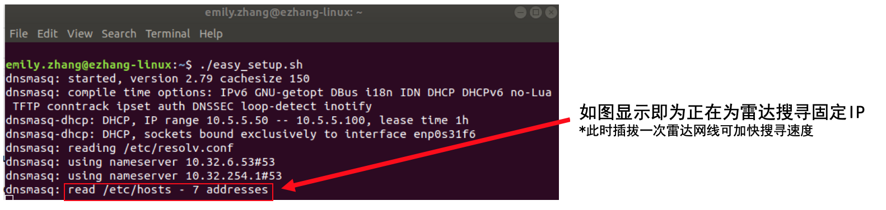
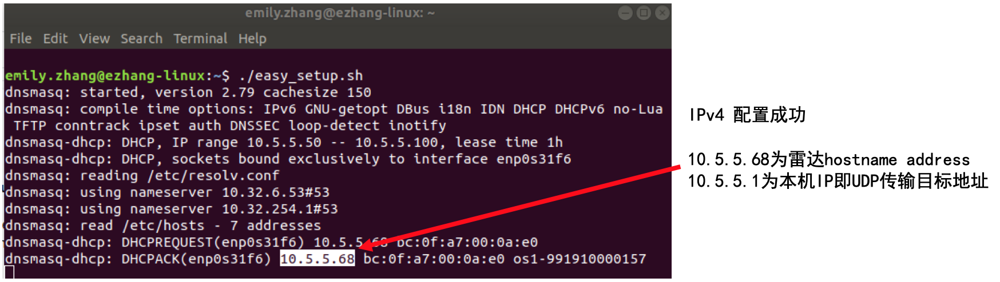

# DHCP 配置激光雷达 IP

> Ubuntu 16 && Ubuntu 18

Ouster 激光雷达采用UDP和TCP进行传输，并采用动态主机配置协议（DHCP）自动获取lP地址和子网掩码。为了方便激光雷达的测试和开发使用，推荐使用DNSmasq为雷达配置IP地址。本教程以`Ubuntu 18.04`为例，介绍如何为 Ouster 配置本地 IPv4 地址。


1. 正确连接雷达连线、网线和转接盒
2. 雷达上电，确定雷达运转，将网线连接到本机网口上（本机网口需支持千兆传输）
3. 打开命令行，输入 `ip addr` 或 `if config` ，确认雷达使用网口名称，本例中网口名称为 `enp0s31f6`

4. 利用`DNSmasq`为雷达设置IP，命令行输入如下命令:

	```bash
	sudo ip -4 addr flush dev [网口名]
	sudo ip addr add 10.5.5.1/24 dev [网口名] #设置该网口IP为10.5.5.1
	sudo ip link set [网口号] up
	sudo dnsmasq -C /dev/null -kd -F 10.5.5.50,10.5.5.100 -i [网口名] --bind-dynamic #在10.5.5.50和10.5.5.100之间为雷达搜寻可用IP
	```

5. 雷达IP设置成功显示如下图：

6. 检测雷达连接
	- 另开命令行，输入`ping -c5 [雷达IP] #本例中ping -c5 10.5.5.68`，检测雷达通讯是否畅通
	- 在浏览器（推荐Chrome）中输入雷达IP，可访问雷达主页，查看雷达状态，更新硬件，以及查看诊断信息等
	

> 参考 [Ouster软件用户手册](https://data.ouster.io/downloads/software-user-guide-v1.13.0.pdf) 3.1 章 Network Configuration - Running A Local DHCP Server 

---
[回首页](README)