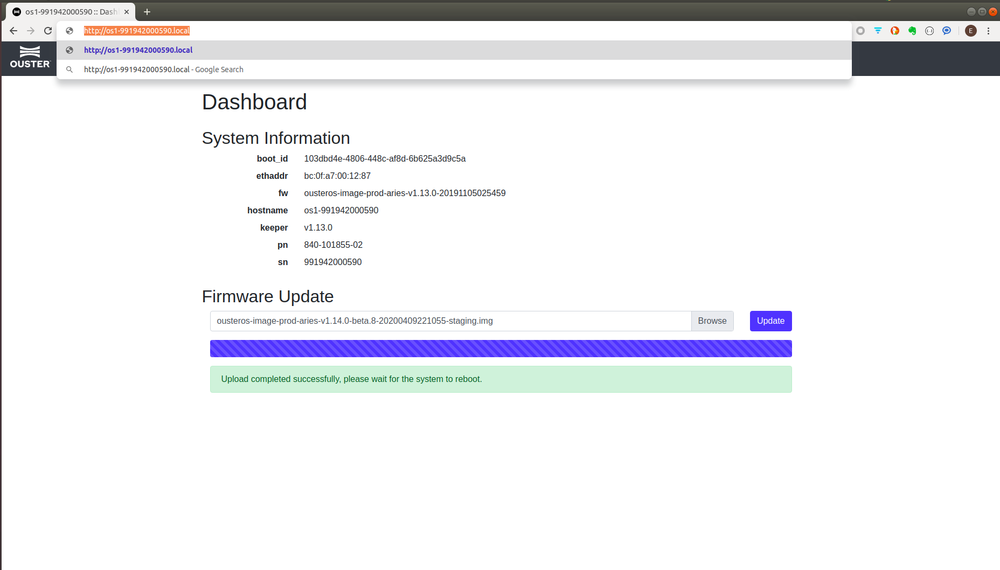
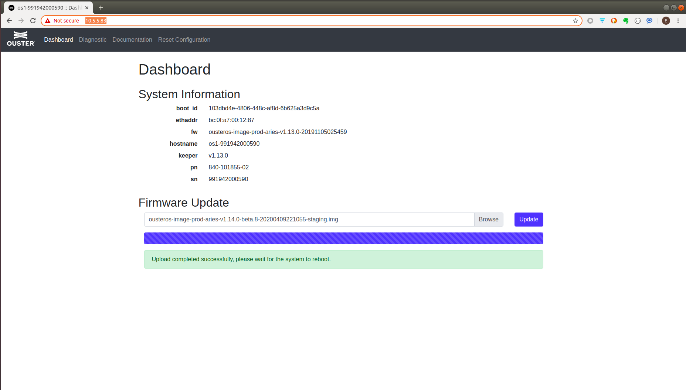
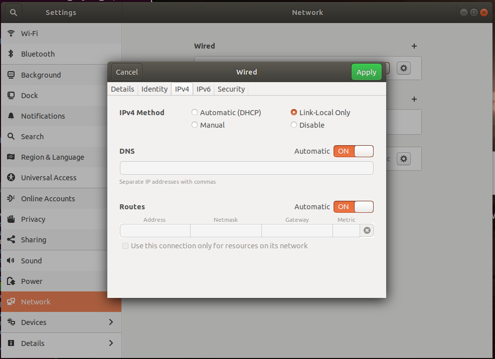
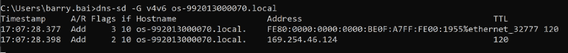
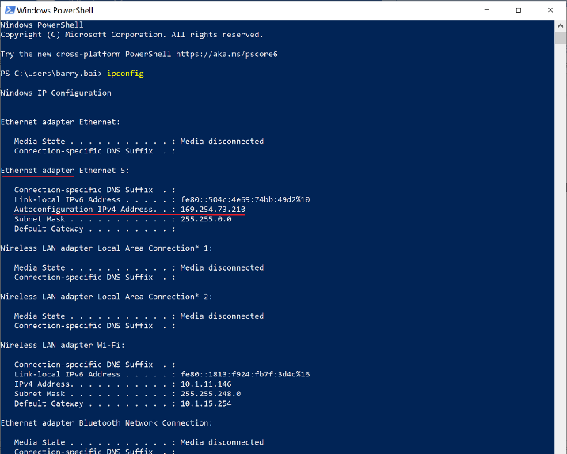

# 网络连接

Ouster 激光雷达使用以太网进行通讯，利用 UDP 进行激光点云和 IMU 的数据传输，利用 TCP 对雷达进行状态查询和配置，也提供 HTTP API （详情见用户手册）可以查询雷达和对一些功能进行设置。

## 查找雷达 IPv4 地址

无论是 UDP 还是 TCP，在和雷达通讯前都需要为雷达分配一个本机网络下的可用IPv4地址。下面是不同系统寻找雷达IP地址的方法：

### Ubuntu - avahi-browse

Ouster 雷达在DNS中的服务实例为 `_roger._tcp` 在命令行中输入 `avahi-browse -lr _roger._tcp` 可以搜索到所有连接到网络中的雷达信息：


其中 *hostname* 为该雷达的域名，后面的数字为雷达序列号。可以通过过任一浏览器输入地址 http://hostname (例：http://os1-991946000317.local) 访问雷达网页接口。



*address* 为该雷达 IPv4 地址，浏览器可以直接输入该地址访问网页接口。



如果返回命令中没有IPv4地址，请将有线连接模式改为**仅本地连接**，重新插拔网线或重启本地网络功能后再次尝试 `avahi-browse -lr _roger._tcp` :



### MAC - dns-sd

MAC OS 系统下，可以使用 `dns-sd` 命令来查找连接雷达的IPv4地址。

```
dns-sd -B "_roger._tcp"
```


返回雷达连接的网络实例 ***OS Instance xxx***，查询该实例的连接情况。

```
dns-sd -L "instance name" "_roger._tcp
```


返回 *hostname*，可以用来访问雷达。

通过 Ping 该 *hostname* 可以查看雷达的IPv4地址，并检查网络情况。


遇到如上图可以查询 *hostname* 但是 Ping 不通的情况，请关闭wifi，再次尝试。


### Windows

Windows 系统可以通过下载安装 [**Bonjour**](https://eyun.baidu.com/s/3kWjPGSB) 工具使用 `dns-sd` 命令。例：

```
dns-sd -G v4v6 os-xxxxx.local
```


## 查找本地 IPv4 地址

只有在得知目的地IP地址后，激光雷达才开始将数据通过 UDP 的形式发送到该地址。下面是不同系统中寻找本机网络端口 IPv4 地址的方法：

### Ubuntu/Mac - ifconfig/ip a/ip addr

在Linux系统下，可以通过 `ifconfig`，`ip a`或`ip addr`命令查询本地IPv4地址，打开命令行，输入上述三个命令其中之一，返回本地IPv4地址如下：


### Windows - ipconfig

在 Windows 系统中的 Powershell 或 CMD 中输入 `ipconfig` 可以查询本地IPv4：




## 单播/广播/组播

可以通过 TCP 设置参数 `udp_ip` 对雷达 UDP 通讯的目标地址进行设置。该参数未设置时，上电后激光雷达将不输出数据，直到接收到该项的相关配置，示例代码：

```
set_config_param udp_ip <ip address>
reinitialize
```

如果需要雷达上电后直接向固定地址输出数据，实现**单播/广播/组播**功能，则在设置`udp_ip`参数并重新初始化后，保存该配置：

```
write_config_txt
```
如果不知道目标IP地址，则可以使用命令`set_udp_dest_auto`，该命令让总动配置雷达将数据发送到发出该命令的地址。

---
[回首页](README)