# Ouster ROS 完整教程
> 适用 Ubunut 18.04 及 Ubuntu 16.04

Ouster提供基于ROS1的节点驱动，可以方便的查看点云数据并进行基于Ouster点云和图像的机器学习和深度学习算法验证。


## 安装编译Ouster ROS

1. 根据ROS官方安装指南正确安装ROS
    - 如果你使用的是 Ubuntu 16.04, 请安装 [ROS Kinetic](http://wiki.ros.org/kinetic/Installation/Ubuntu)
    - 如果你使用的是 18.04, 请安装 [ROS Melodic](http://wiki.ros.org/melodic/Installation/Ubuntu)
    - 这个教程使用 `Ubuntu 18.04` 和 `ROS Melodic` 

2. 将官方开源文件 `ouster_example` 解压到你本地的机器上
    - 或者用以下代码从GitHub上克隆 `git clone https://github.com/ouster-lidar/ouster_example.git`
    - 以下教程中, `ouster_example` 文件夹默认存储与 `home` 目录下, 所以绝对地址是 `/home/YourUserName/ouster_example`，相对地址 `~/ouster_example`

3. 编译
    1. 打开一个新的命令行，输入`export CMAKE_PREFIX_PATH=~/ouster_example`
    2. 加载相应版本的ROS配置文件，命令行输入 `source /opt/ros/[kinetic_or_melodic]/setup.bash` 
    3. 返回 `home` 文件目录下，命令行输入 `cd ~`
    4. 在命令行中输入下面的命令，创建ROS Node目录并编译：
	
	```bash
	mkdir -p ros_ws/src && cd ros_ws && ln -s ~/ouster_example ./src/ && catkin_make -DCMAKE_BUILD_TYPE=Release`
	```
	
	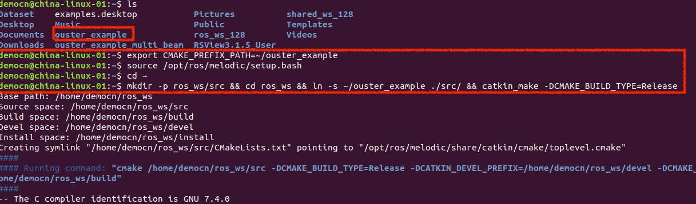
	
    5. 如下图显示则为编译成功:

	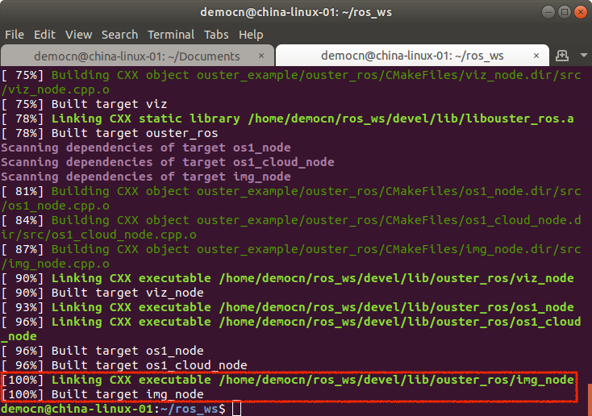

## 安装过程中可能遇到的问题
1. **fatal error: tclap/CmdLine.h: No such file or directory**
- 命令行运行 `sudo apt install libtclap-dev`

## 用ROS查看实时点云

1. 正确连接雷达

2. 打开命令行，到编译好的ROS工作目录下（本例中该目录为 `~/ros_ws`）：

	```
	cd ~/ros_ws
	```
3. 加载ROS Ouster环境，命令行输入 `source devel/setup.bash`

	
	
4. 命令行输入 `cd src/ouster_example/ouster_ros/` 转到*ouster_ros*目录下，该目录下包含运行ouster ros节点所需文件`os1.launch`

	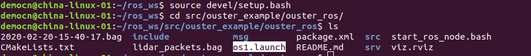
	
5. 命令行输入以下命令，启动 ROS Ouster (示例中雷达IP为10.5.5.66, 本机IP为10.5.5.1):

	```bash
	roslaunch os1.launch os1_hostname:=<雷达IP>  os1_udp_dest:=<本机IP>  viz:=true image:=true
	```
	- `os1_hostname:=`：为雷达IP地址
	- `os1_udp_dest:=`：为本机IP地址
	- `viz:=`：`true` - 开启 Ouster Visualizer 显示点云和2D环视图，缺省默认为`false`
	- `image:=`：`true` - 开启2D环视图节点，可在`rviz`中查看，缺省默认为`false`
	- `lidar_mode:=`： 雷达运行模式选项，可选`512x10 | 512x20 | 1024x10 | 1024x20 | 2048x10`, 缺省默认为`1024x10`
	
	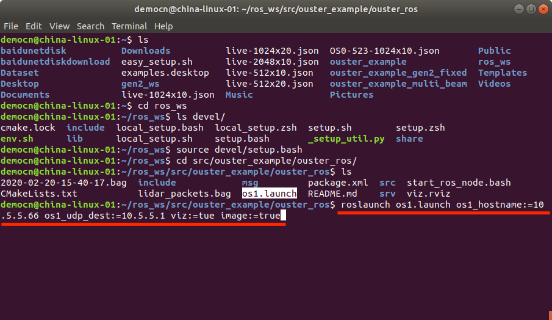
	
	节点启动成功如下图：
	
	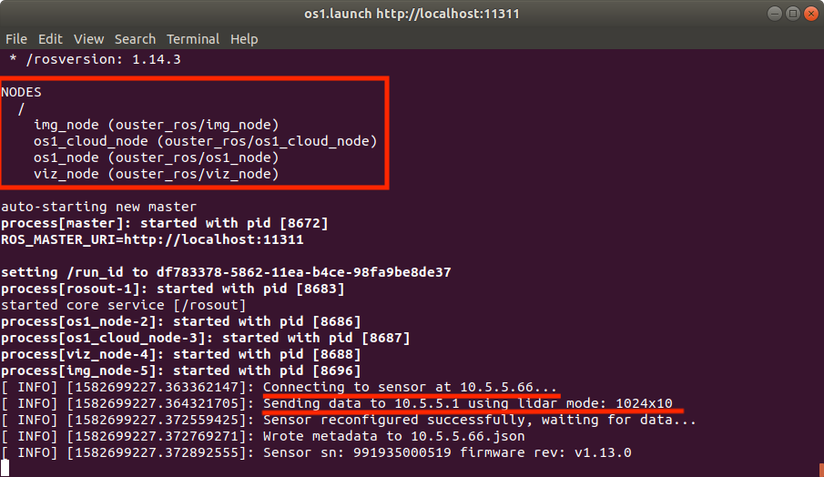
	
	如果`viz:=true`开启Ouster Visualizer, 则弹出窗口显示数据：
	
	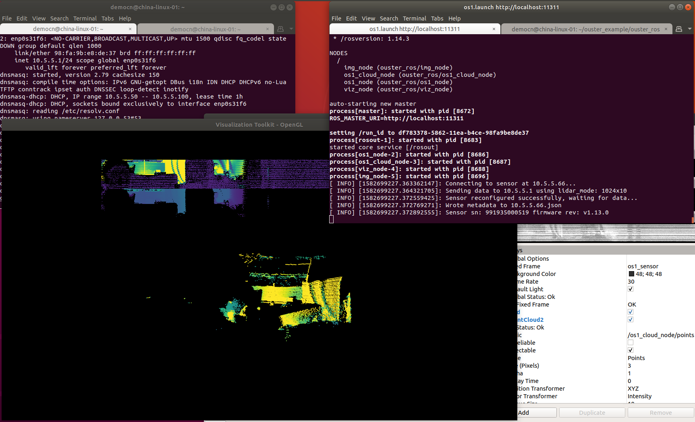
	
6. 用`RVIZ`查看雷达输出，用快捷键`shift+ctl+t`新开启一个命令行页面，输入`rviz -d viz.rviz`，启动rviz查看点云或2D环视图：

	
	
## 录制点云

1. 确保雷达连接正确，启动 ROS Ouster。
2. 新开启一个命令行，输入`rosbag record /os1_node/imu_packets /os1_node/lidar_packets -O "<要保存的文件名.bag>"`

	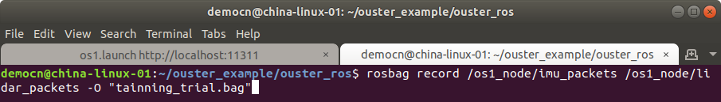
	
	开始录制：
	
	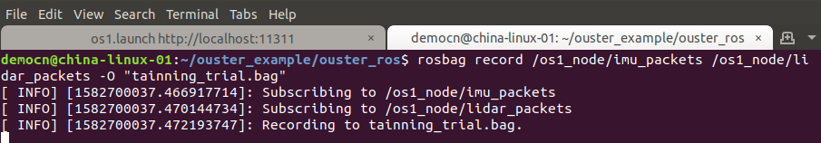
	
	选中命令行，快捷键`ctl+c`停止录制。
	
## 播放录制的点云文件（不需要雷达）

1. 关闭所有运行中的命令行，结束正在运行的所有ROS节点
2. 打开命令行，定位到编译好的 ROS Ouster 工作目录下（本例中该目录为 `~/ros_ws`）：

	```
	cd ros_ws
	```
3. 加载环境，命令行输入 `source devel/setup.bash`

	
	
4. 命令行输入 `cd src/ouster_example/ouster_ros/` 转到`ouster_ros`目录下，该目录下包含运行ouster ros节点所需文件`os1.launch`

	
	
5. 命令行输入以下命令，启动ros节点(示例中雷达IP为10.5.5.66):

	```bash
	roslaunch os1.launch replay:=true os1_hostname:=<雷达IP>  viz:=true image:=true
	```
	- `os1_hostname:=`：如果录制文件的雷达曾经在本机上运行过，可以再次输入雷达IP，雷达参数文件会自动加载
	- `viz:=`：`true` - 开启 Ouster Visualizer 显示点云和2D环视图，缺省默认为`false`
	- `image:=`：`true` - 开启2D环视图节点，可在`rviz`中查看，缺省默认为`false`
	- `metadata:=`： 雷达参数文件的绝对地址，如果有雷达参数的json文件，请在此输入参数文件的绝对地址
	
	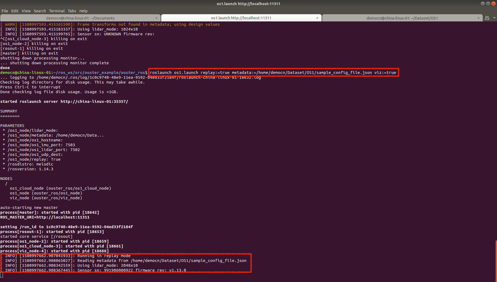

	如果`viz:=true`开启 Ouster Visualizer, 则弹出窗口显示数据：
	
	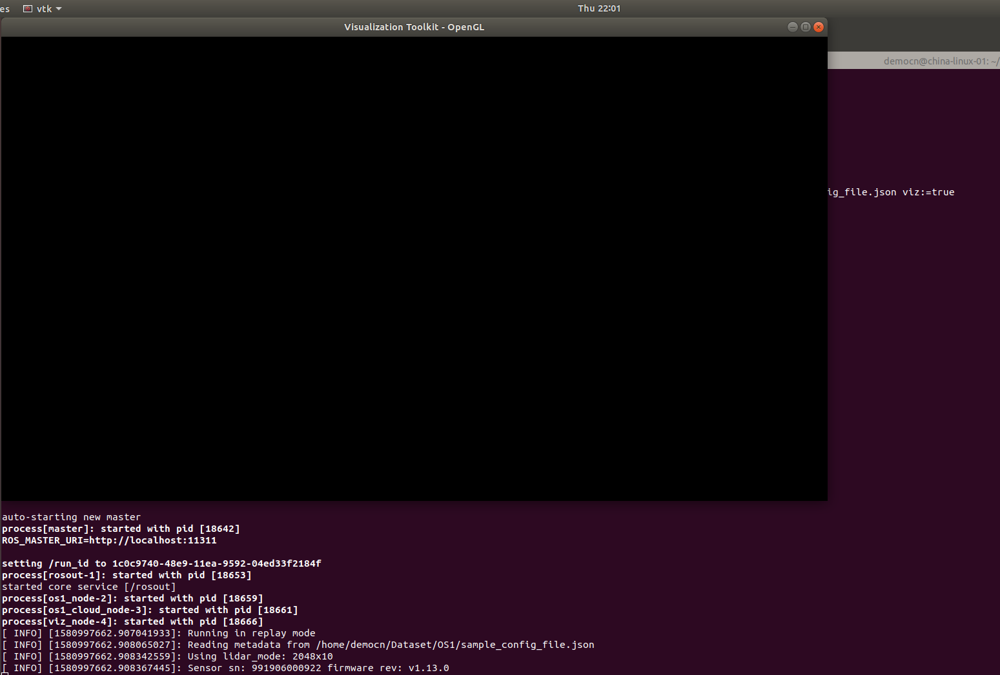
	
6. 开启新命令行，转到录制文件`.bag`的存储目录，输入`rosbag play -l --clock <录制数据文件名.bag>`:
	
	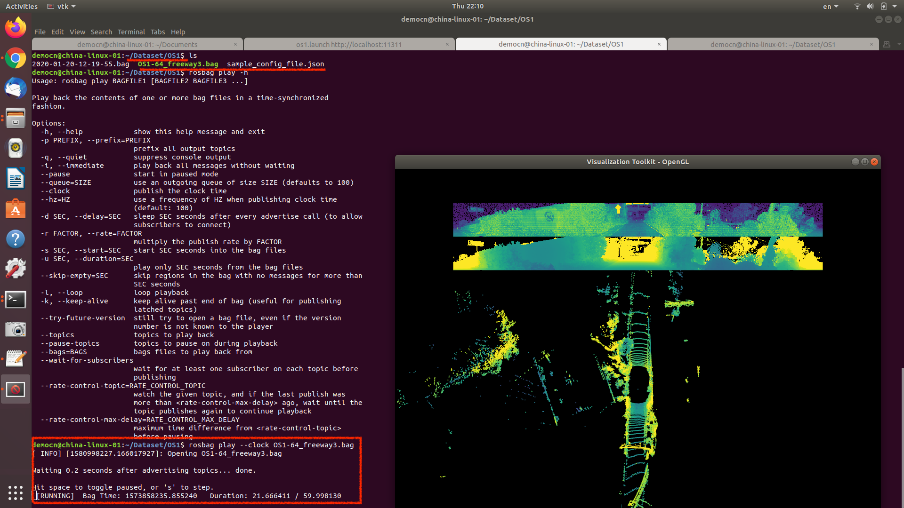
	- `-l`：循环播放

7. 用`RVIZ`查看雷达输出，用快捷键`shift+ctl+t`新开启一个命令行页面，输入`rviz -d viz.rviz`，启动rviz查看点云或2D环视图：

	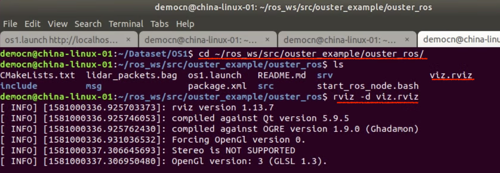

## ROS Ouster 节点（topic）解释（待更新）

## 通过 ROS Ouster 获得 `PointCloud2` 数据（待更新）
