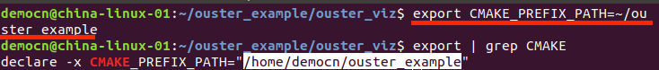
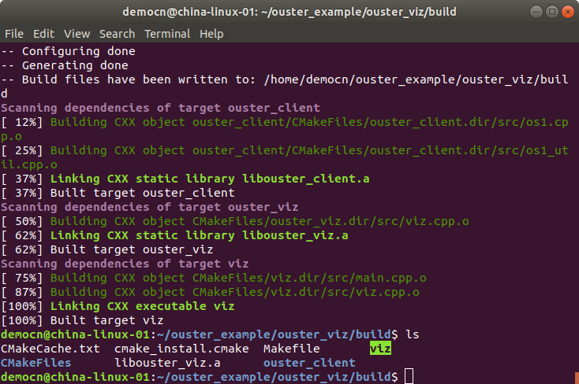
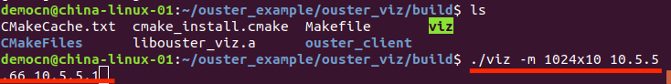
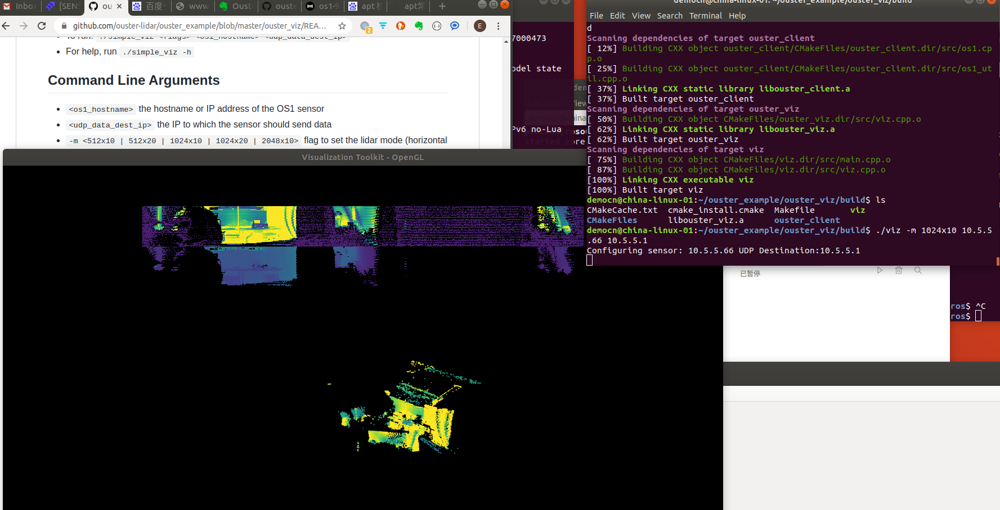

# Ouster Visualizer使用指南（无需ROS）
> 适用 Ubunut 18.04 及 Ubuntu 16.04

## 准备

1.将官方驱动文件 `ouster_example` 解压到本地的机器上

- 或者用以下代码从GitHub上克隆 `git clone https://github.com/ouster-lidar/ouster_example.git`
- 以下教程中, `ouster_example` 文件夹默认存储与 `home` 目录下, 所以绝对地址是 `/home/YourUserName/ouster_example`，相对地址 `~/ouster_example`

2.安装依赖库 `sudo apt install libvtk6-dev libeigen3-dev`

## 编译 **Ouster Visualizer**

1. 载入**CMAKE**编译目录，打开命令行，输入
	
```bash
export CMAKE_PREFIX_PATH=~/ouster_example
```

其中`~/ouster_example`为ouster_example文件所在路径
	

	
2. 命令行中输入

```bash
cd ~/ouster_example/ouster_viz && mkdir build && cd build && cmake -DCMAKE_BUILD_TYPE=Release .. && make
```
编译成功如下图显示:
	


也可在 `ouster_viz/build` 文件夹下查看，成功编译会生成 `viz` 文件，如图：
	

	
## 使用 **Ouster Visualizer**
1. 命令行定位到 `ouster_viz/build` 文件夹下 `cd ~/ouster_example/ouster_viz/build`
	
2. 运行 `./viz <os1_hostname> <udp_data_dest_ip> -m <lidar_mode>` 其中
	- `<os1_hostname>` 为雷达地址，eg：10.5.5.66
	- `<udp_data_dest_ip>` 为主机地址, eg: 10.5.5.1
	-  `<lidar_mode>` 选择雷达运行模式，默认为 1024x10，可选填 512x10 | 512x20 | 1024x10 | 1024x20 | 2048x10
	
	
	
	成功运行弹出显示窗口，雷达停机，稍等一会，雷达重新启动，显示窗口出现点云：
	
	

## 键盘快捷键

| 快捷键 | 功能 |
| ----| ------------ |
| `o` | 增大点的体积 |
| `p` | 减小点的体积 |
| `m` | 循环点击按照 z-height / intensity / z-height plus intensity / range 等特征显示点云颜色  |
| `c` | 切换2D图像的显示颜色 |
| `shift c` | 切换点云的显示颜色 |
| `v` | 切换2D图像的颜色循环 |
| `n` | 显示环境光图像 |
| `r` | 重置相机角度
| `0` (零) | 切换平行投影并复位相机 |
| `d` | 调整2D图像和点云图像的显示比例 |