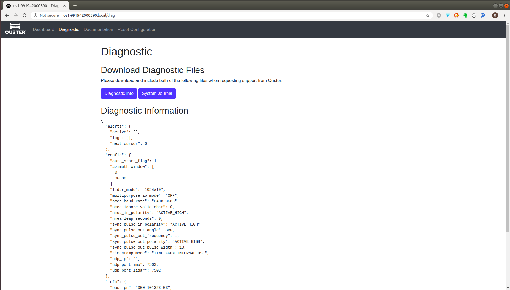
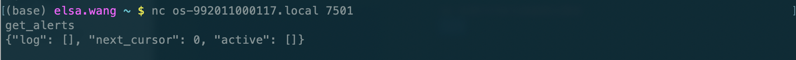

# 常见故障排除

> YES! Trust yourself, you can nail it down!!

## 网络连接故障

通常情况下，Ouster 激光雷达会通过 DHCP 为自己在相连的计算机网络中分配一个IPv4地址用于数据传输，并将雷达序列号地址与IPv4绑定，方便访问雷达内置的 http 页面。

[网络连接](Network.md) 应该可以解决大部分的网络问题。如果仍然遇到不能访问或雷达数据丢包的情况，可以参考以下步骤检查并修复问题：

0. 确认雷达为设置静态IP。
1. 检查硬件设备是否支持**千兆**网络传输，包括网线、网络接口、路由、交换机（如果使用）。
2. 如果不使用Ouster官方随附的电源线，请确定雷达输入电压为24V。
3. 关闭WIFI和防火墙，WIFI和防火墙有时会干扰雷达的网络连接和数据传输。

## 利用雷达自诊断页面查看雷达警报

可以通过查看雷达诊断(Diagnostic)页面查看雷达是否正常运行，

当雷达运行出错时，会进行报错，诊断页面会显示错误代码，错误等级，措施描述和修复方法。

Ouster 错误分为：
- 错误(Error)：发生错误，不能正常工作
- 警告(Warning)：发生错误，影响雷达性能
- 注意(Notice)：发生错误，可能影响雷达性能

错误代码和详细解析请联系Ouster技术支持获取下载。

如果错误代码给出的解决方案不能帮助您解决问题，请在诊断页面点击 ***Diagnostic Info*** 和 ***System Journal*** 下载诊断和日志文件发送给技术支持人员或上传到 [**Ouster 支持中心**](https://ouster.atlassian.net/servicedesk/customer/portal/8/group/22/create/86)。

## 利用TCP命令查看雷达警报

也可以尝试[TCP命令](tcpCommand)的连入雷达，输入`get_alerts`查看雷达报警信息:

---
[回首页](README)