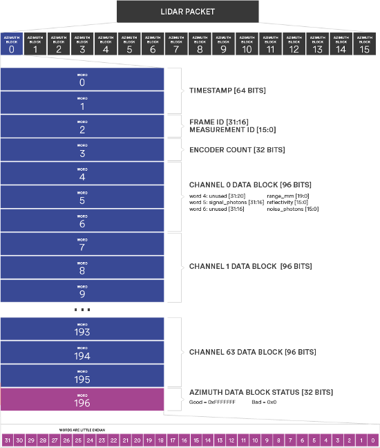
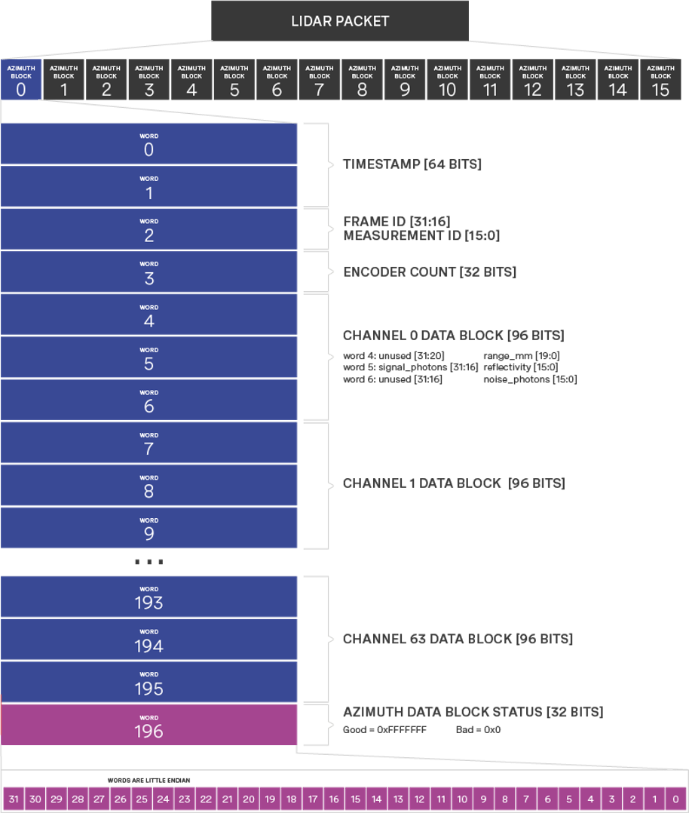
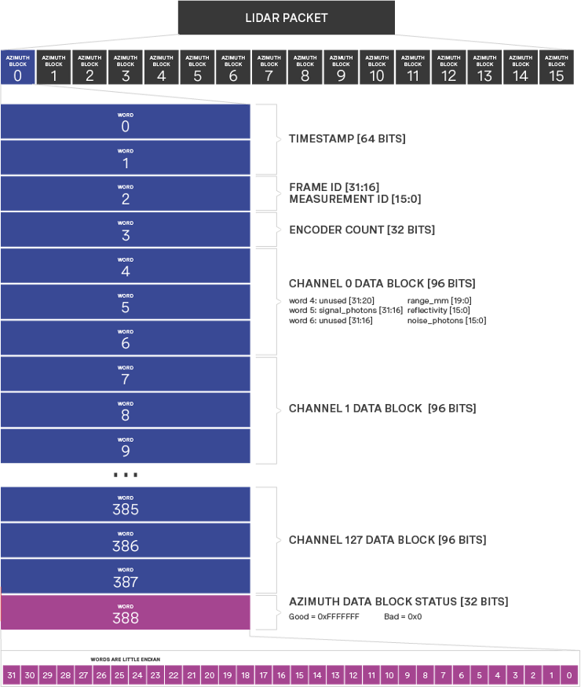

# Ouster 数据结构

> 固件1.13及之前的版本数据结构和这章描述的不一样，请联系技术支持咨询相关资料。

## UDP 数据包

Ouster 激光雷达的每个数据包由16个方位角数据块组成，数据包大小根据传感器中的线数有所不同。数据包速率取决于激光雷达模式。单字段（word）长 32 bit，低位优先。默认情况下，激光雷达UDP数据发送到端口7502。

以 **1024x10** 模式下的64线激光雷达为例，雷达每秒转10圈，每圈激光器发射1024次，所以共有方位角1024个，每16个方位角的数据组成一个UDP包发送出去，激光雷达转一圈会发送64个UDP包，一秒钟发送640个UDP包。

每个方位角数据块包含：
- **时间戳** [64 bit unsigned int] – 以纳秒为单位。
- **测量ID** [16 bit unsigned int] – 方位角计数。根据激光雷达的模式从0到511、从0到1023或从0到2047的顺序递增。 
- **帧ID** [16 bit unsigned int] – 激光雷达扫描圈数。传感器每旋转一圈，越过编码器的零点时增加1。
- **编码器计数**[32 bit unsigned int] – 方位角的原始编码器计数，从0开始，最大值为90,111 – 在2048模式下，每个方位角增加44个刻度，在1024模式下，增加88个刻度，在512模式下，增加176个刻度。
- **线数数据块**[96 bit] – 每个线数拥有一个先数数据块，包含：
    - ***距离***(Range) [32 bit unsigned int - 仅使用20bit] – 以毫米为单位，最小测量精度为3毫米。
    - ***光子信号***(Signal Photons) [16 bit unsigned int] – 测量返回信号中的光子强度。
    - ***反射率*** (Reflectivity) [16 bit unsigned int ] – 目标反射率。传感器的光子信号测量值会受到将根据测量的距离和该距离范围内的传感器灵敏度影响。该值可以去除影响，反应目标真是反射率。注意：目前尚未严格执行此测量的校准，严格校准功能将在以后的固件版本中对更新。
    - ***环境光子***(Ambient Photons) [16 bit unsigned int ] –  测量返回信号中的环境中的光子强度。
- 方位角数据块状态[32 bits] – 表示该方位角数据块是否包含有效数据。有效 = 0xFFFFFFFF，无效 = 0x0。如果方位角数据块损坏（例如，某列列数据丢失），则数据块中该值将设置为0x0，但时间戳记，测量ID，帧ID和编码器计数将保持有效。

## 16线雷达

各系列16线激光雷达每个UDP包大小为3392bytes。

## 32线雷达

各系列32线激光雷达每个UDP包大小为6464bytes。

## 64线雷达

各系列64线激光雷达每个UDP包大小为12608bytes。

## 128线雷达

各系列128线激光雷达每个UDP包大小为24896bytes。

[回首页](README)