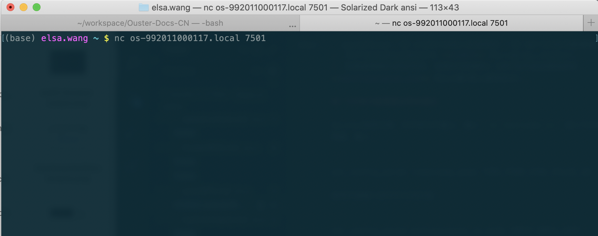
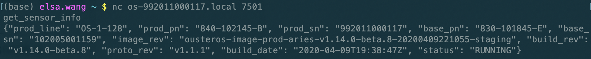
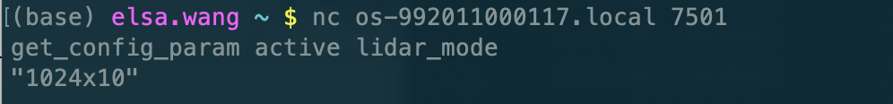
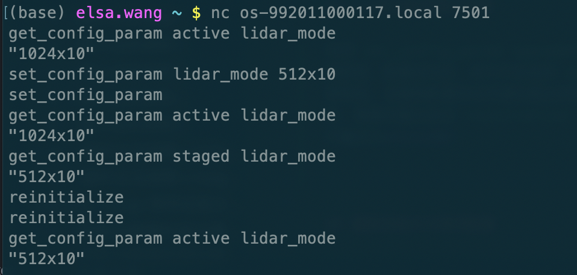

# TCP 命令查询和配置雷达

> 是的，GUI配置接口难产中~

Ouster 激光雷达可以使用TCP向雷达端口7501发送纯文本协议对进行查询和配置。

以Linux系统下命令行 ***netcat*** 工具为例，连接好雷达，找到雷达的IP或hostname，打开命令行，在其中输入`nc ip/hostname 7501`，回车进入操控界面（**注意**：进入操控界面没有任何提示返回。)，如下图:

## TCP命令查询雷达状态

利用 `get_xxx` 形式的命令查询雷达的状态和配置，返回为JSON格式的信息，如用`get_sensor_info`查询雷达的硬件和固件信息:

这些信息也可以在雷达的http主页进行查询，其中 ***status*** 表示雷达状态，Ouster雷达有以下几种状态:

| 状态 | 解释 |
| ----| ------------ |
| `INITIALIZING` | 传感器启动初始化中，没有数据输出。 |
| `UPDATING` | 固件升级中，正将新固件写入雷达。 |
| `RUNNING` | 正常运行中。  |
| `ERROR` | 发生错误，在诊断页面查看错误信息。 |
| `UNCONFIGURED` | 联系工程团队，准备返厂吧~ |

### 查询命令列表：

| 命令 | 解释 |
| ----| ------------ |
| `get_config_txt` | 查询雷达的所有配置信息和状态。 |
| `get_sensor_info` | 查询雷达的硬件和固件信息。 |
| `get_time_info` | 查询雷达的时间同步配置信息。  |
| `get_beam_intrinsics` | 查询光束仰角，方位角，坐标原点信息。 |
| `get_imu_intrinsics` | 查询IMU坐标转换矩阵。 |
| `get_lidar_intrinsics` | 查询激光雷达坐标转换矩阵。|
| `get_alerts ` | 查询雷达报警信息。 |
| `get_lidar_data_format` | 查询雷达的数据信息，用于雷达矩阵变换。 |

雷达的可配置参数可以通过`get_config_param active/staged <parameter>` 查询。其中**active**表示雷达当前正在使用的配置；**staged**表示雷达的暂存配置，这些配置将在雷达重新初始化后生效。如下图，用`get_config_param active lidar_mode`查询雷达的运行模式：

可查询的参数和下面可配置的雷达参数一致，详见下面的参数列表。

## TCP命令配置雷达参数

利用`set_config_param <parameter> <value>` 可以为雷达的可配置参数设置新值。

配置成功后，命令行会返回`set_config_param`，表示雷达已经接收到新参数值，该最新配置将会存储在雷达的暂存区(staged)，不会生效。想要新配置生效，需要向雷达发出`reinitialize`命令让雷达重新初始化。

如下图，配置雷达运行模式为*512x10*：

一开始激光雷达的运行模式为*1024x10*, 发送*512x10*配置命令后，雷达当前模式依旧为*1024x10*，但`get_config_param staged lidar_mode`命令查询显示*512x10*配置已经写入暂存区，在运行`reinitialize`命令重新初始化后，雷达当前运行模式为*512x10*。

### 可配置参数列表：

如果需要查询，参考上一节 `get_config_param active/staged <parameter>`，不需要家后面` <...> `的具体值，例如`get_config_param active udp_ip`。

| Parameter | 解释 |
| ----| ------------ |
| `udp_ip <ip address>` | 设置雷达启动即将数据发往的IP地址，参考[**单播/广播/组播**](Network#单播/广播/组播)。|
| `udp_port_lidar <port>` | 设置UDP点云数据的端口，默认为7502。 |
| `udp_port_imu <port>` | 设置UDP IMU数据的端口，默认为7503。。  |
| `lidar_mode <mode>` | 配置雷达运行模式。可选512x10/1024x10/2048x10/512x20/1024x20。 |
| `timestamp_mode <mode>` | 配置雷达的时间同步模式，详情见[**GPS同步**](syncGPS)。 |
| `nmea_in_polarity <ACTIVE_HIGH/ACTIVE_LOW>` | 配置针对NMEA UART输入$GPRMC消息的启用极性，详情见[**GPS同步**](syncGPS)。|
| `nmea_ignore_valid_char <1/0>` | 配置是否根据有效字符忽略NMEA消息。 |
| `nmea_leap_seconds <s>` | 配置NMEA闰秒，详情见[**GPS同步**](syncGPS)。 |
| `nmea_baud_rate <BAUD_9600/BAUD_115200>.` | 配置接收的NMEA消息的波特率，详情见[**GPS同步**](syncGPS)。 |
| `auto_start_flag <1/0>.` | 配置雷达启动时是否进入休眠模式，详情见用户手册。 |
| `multipurpose_io_mode <mode>` | 配置雷达出书的同步信号模式，详情见用户手册。 |
| `sync_pulse_out_polarity <<ACTIVE_HIGH/ACTIVE_LOW>` | 配置雷达输出的同步信号的启用极性，详情见用户手册。  |
| `sync_pulse_out_frequency <rate in Hz>` | 配置雷达输出的同步信号的频率，详情见用户手册。 |
| `sync_pulse_out_angle <angle in deg>` | 配置雷达按旋转角度输出同步信号的角度，详情见用户手册。 |
| `sync_pulse_out_pulse_width <width in ms>` | 配置雷达输出的同步信号的带宽，详情见用户手册。|

## 重新初始化和写入配置

`reinitialize`命令让雷达从暂存区读取最新的配置参数。初始化成功返回`reinitialize`。

`write_config_txt`将当前活动参数写入雷达内的配置文件，这样这些活动参数才会在下次重新上电后被当做默认参数读取。写入成功后返回`write_config_txt`。

---
[回首页](README)