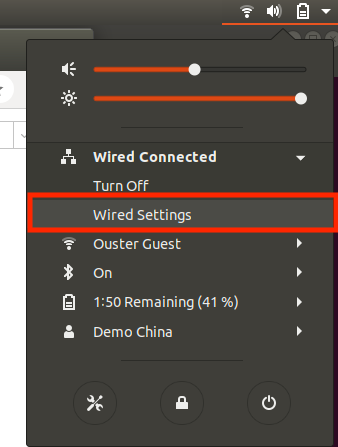
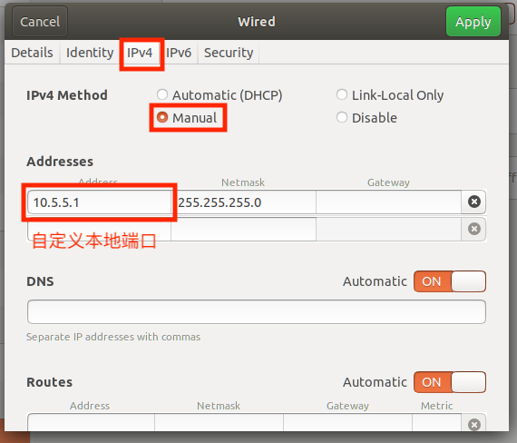
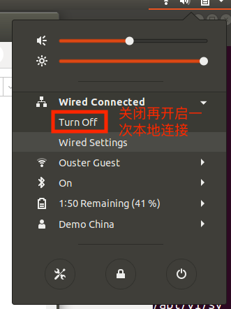
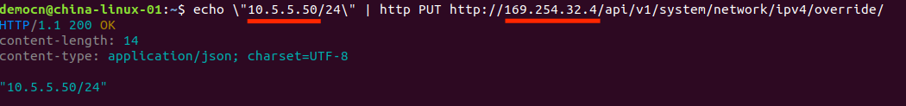

# Ouster LiDAR 静态IP设置


> Ubuntu 16.04 & Ubuntu 18.04

## 准备步骤

### 设置本地端口地址（可跳过）

- 打开网络设置，点击本地连接配置按钮




- 自定义本地端口IPv4地址



- 断开/重新连接本地连接



- 命令行中输入 `ip addr` 检查本地IP设置是否成功


 
### 查找雷达当前IP

 连接雷达, 命令行输入 `avahi-browse -lr _roger._tcp` 查找雷达当前地址（eg. 169.254.32.4）


## `httpie` 方法

### 1.安装 httpie

- 打开命令行（快捷键`Ctl` + `Alt` + `T`)
- `sudo apt install -y httpie`

### 2.验证IP是否为静态IP，命令行输入

```bash
http http://[雷达当前IP地址]/api/v1/system/network/ipv4/override/
```


### 3.设置静态IP

```bash
echo \"[你想设置的静态IP]/24\" | http PUT http://[雷达当前IP地址]/api/v1/system/network/ipv4/override/
```


### 4.取消静态IP

```bash
http DELETE http://[静态IP]/api/v1/system/network/ipv4/override/
```


 
 #### 常见问题

1. **args: List[Union[str, bytes]] = sys.argv**
    - 重装 httpie `sudo apt install httpie --reinstall`

## `curl` 方法（待更新）